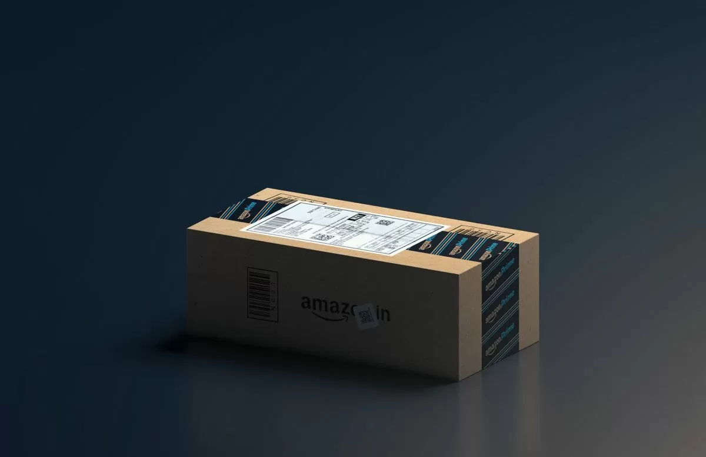



Impulse buying, or impulse purchase, is an unplanned decision by a person to buy a product or service. We are all victims of the marketing strategies deployed by various companies that compel us to buy things we don't really need. In a digitally connected world where everything is convenience-oriented and immediately available, the pleasure of delayed gratification is essentially eliminated. I personally had the habit of impulse buying online and hoarding stuff in the past. If you check my room, you would find all sorts of items that I hardly ever use. One small psychological trick that worked for me is the tested and proven method known as the '72-Hour Rule.' In a nutshell, anytime you feel like purchasing something that is not essential, do not immediately buy it. Instead, delay the purchase decision for 72 hours. In this post, I discuss the importance of the 72-hour rule by listing the external cues that lead to impulsive purchases, followed by tips on how to stop impulse buying through specific strategies.



### The Triggers

Let’s not blame marketers—it’s their job to promote products and influence us to buy. Over the years, marketers have mastered various techniques that push consumers toward impulsive purchasing. Some techniques have evolved over time, especially with the recent surge in e-commerce. However, the underlying psychology remains the same, and today every app with something to sell is [fighting for our attention][1], pushing us to buy things. Before attempting to reduce impulse buying, it's important to understand the cues strategically designed to encourage such purchases:

  * Apps utilize FOMO (Fear of Missing Out) to pressure consumers into making immediate purchase decisions. This is why you often see sale days, discounted prices, and tags like 'Limited Supply' or 'Only 1 remaining.'
  * Same-day delivery, often marketed by Amazon, encourages late-night purchases. Imagine you’re browsing for shoes at 2 AM, and Amazon shows that the shoes can be delivered the same day with a countdown timer. The probability of instant ordering increases significantly.
  * "Pay Later" schemes, especially popular in India, let consumers buy products without entering card information or even when they don’t have money available. Cues like 'Buy Now, Pay Later' can prompt impulsive purchases.
  * Imagine it's noon, and you're hungry. UberEats or Zomato suddenly sends a notification offering a deal at your favorite restaurant. The well-timed trigger, combined with your hunger, often leads to ordering food that you didn’t intend to.
  * Add-on products or services offered at a discount also play on the FOMO strategy, pushing you to buy extras you don’t need.
  * I’m a big fan of eBooks, but the convenience of instantly downloading books to my Kindle has led me to buy a lot of books that I haven’t even started reading.
  * Recommended products are another tactic used by marketers to make us look at items we never intended to purchase.
  * The age-old tactic of placing chocolates or gum at the checkout counter is a classic example of impulse buying cues.

### How to Stop Impulse Buying

After becoming more mindful of my purchases, here are some ways you can avoid impulse buying:

  * The next time you feel like buying something online or offline, evaluate whether the product is a need or a want.
  * Even if it’s a need or a want, unless it’s an emergency, delay the purchase by 72 hours.
  * Do not add the product to your wishlist on Amazon or any other app.
  * After 72 hours, if you still remember the product, evaluate the pros and cons. Make a mental note of why you need it before deciding to purchase.
  * Try not to buy anything online using a credit card or "Buy Now, Pay Later" schemes.
  * Disable app tracking and suggestions so apps cannot provide you with a recommended set of products or services.
  * Disable notifications for apps that aren't essential, such as food delivery, grocery, and e-commerce apps, to reduce external cues.
  * Don’t fall for deals, discounts, or sales days. Just because there’s a sale doesn’t mean you need to buy something.

### Closing Thoughts

Impulse buying doesn’t matter much when it comes to small items like candy or gum. But I’ve had serious issues with impulse buying in the past. Some of the weird items I ordered but never used include a belly fat caliper, fine liner pens, stacks of beautiful journals, a GoPro, and a streaming card. A couple of weeks ago, I was browsing YouTube and saw a video from a famous productivity YouTuber discussing bullet journaling. I immediately opened Amazon and came close to ordering a fancy bullet journal and pens for journaling. But somehow, I remembered the 72-hour rule and didn’t think about bullet journaling again until now, while writing this article. I think the key to controlling impulse purchases is identifying the external cues and being mindful of how we respond to them.



 [1]: /attention-diet/ "How to Start an Attention Diet?"

 
