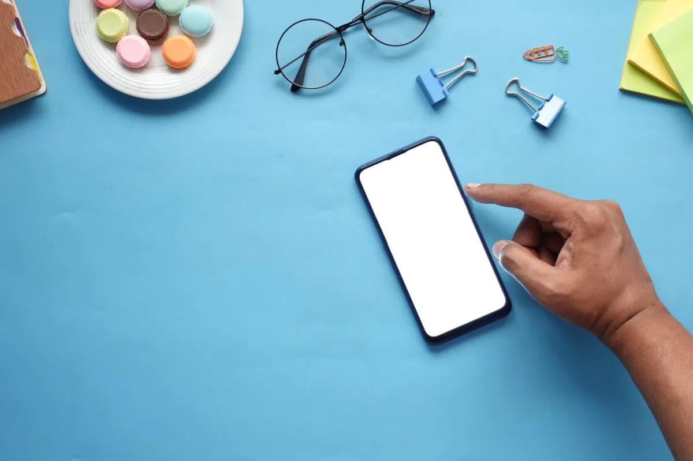



I must admit, I’m quite addicted to my smartphone. My average daily screen time used to reach over 9 hours, which was clearly unhealthy. This article is a follow-up to the one I published last year on [the importance of an attention diet](https://rishikeshs.com/attention-diet/). My smartphone addiction had negative effects on me, such as neck and back pain due to poor posture, lack of attention, and an inability to concentrate. Since we are living in the 21st century and our world is quite interconnected, there was no point in disowning a smartphone. I came across the idea that the only way to stop my phone addiction was to make my phone boring. The boring phone is a sequence of steps or methods one can take to ensure that their smartphone becomes so boring to use. This might sound funny, but the trick clearly worked for me, and within a few months of implementing this in my life, I saw my screen time reduce by over 70%.



The idea was to ensure that I consumed as little information as possible via my smartphone and reduced as many triggers that forced me to pick up my phone. My primary means of information consumption was through my laptop, and I used my phone to consume content only while traveling or during unavoidable circumstances. Below are some steps and tips that I followed in the Boring Phone framework to reduce my smartphone addiction. I don’t claim that following these steps made me completely free from smartphone addiction, but they did have a significant impact on my life. Any suggestions mentioned in the comments that are relevant to this framework will be added to this article with credit.

  * Try to use a smartphone with a smaller screen size. A smaller screen size means it’s harder to watch video content. I made the switch a couple of months back from OnePlus to an [iPhone 13 Mini](https://geni.us/rsh-13-mini), which has a 5.4" screen. I no longer watch very long content on my phone as the screen is too small!
  * Ensure that there are no streaming apps on your smartphone. This includes Netflix, YouTube, etc. I even canceled my YouTube Premium subscription as I found that ads actually prevent me from watching content for too long.
  * Do not grant permission for all apps to send notifications. Only give notification access to apps that are extremely important, like banking-related apps.
  * Set your phone on silent mode or DND (Do Not Disturb) as much as possible.
  * Turn off the notification sound on your smartphone.
  * Uninstall all social media apps from your smartphone and access them only via the web using your laptop.
  * Turn off all recommended and personalized suggestions across apps. If you’re using an iOS device, ask the app not to track your information.
  * Do not browse Wikipedia on your smartphone browser.
  * Make use of focus modes on your smartphone. If you’re working, set your phone to work mode so you stay undistracted.
  * Even if your phone is slower, try not to upgrade, as a faster phone can keep you addicted for longer periods.
  * Do not install any games on your smartphone.
  * Do not sleep or wake up with your phone next to your bed. Ensure that your phone is at least a few steps away from your bed.
  * Do not use your smartphone in the toilet. I prefer reading newspapers or using a [Kindle](https://geni.us/rsh-kindle-paperwhite) while in the toilet.
  * Make a decision that while consuming content on your smartphone, you do it only while sitting in a chair or standing, but not in bed.
  * Try not to use your smartphone at least 30 minutes before sleeping and after waking up.
  * Set a boring wallpaper so that you don’t have any visual cues to pick up your smartphone, even to check the picture.
  * While traveling and taking photos, ensure that your phone is in flight mode. This makes you more mindful while clicking photos.

Long story short, make your phone boring to use.


