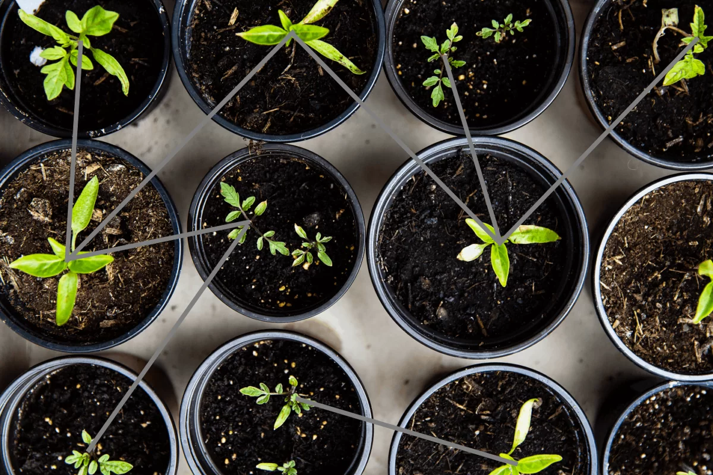




[Digital Garden](https://notes.rishikeshs.com) is a collection of notes, resources, ideas, quotes, or summaries shared publicly. Unlike a blog post or a published essay, there is no publication date in a digital garden. Everything published in a [Digital Garden is evergreen](https://maggieappleton.com/garden-history) and grows over time. Nothing is considered finished work, and the garden evolves. Digital Gardens are usually lightweight and focus on text and content over the fancy styling features of modern websites.




[Read more about the History and Ethos of Digital Gardens](https://maggieappleton.com/garden-history).




## Features 

  * Publication dates are not important to Digital Gardeners. Posts are connected via references or common themes.
  * There are no featured posts or chronological lists of items. Readers can enter through any note, follow any trail, and exit as they wish.
  * Digital Gardens are constantly evolving and are never complete. There is no pressure to publish a perfect post in digital gardens as notes grow over time, just like plants in a garden.
  * Every Garden is unique, as the patterns and relationships between notes vary from person to person.
  * Gardens are a way of learning in public, opening more possibilities for collaboration.

## How I Built My Digital Garden Using Hugo

Since today’s internet is full of blogs and websites filled with scripts and trackers, I decided to keep my Digital Garden simple. I was already frustrated with the performance of WordPress on this blog and wanted something lightweight. I explored various static website frameworks and finally decided to build one using [Hugo][1]. Hugo was the obvious choice since I already use [Obsidian](https://obsidian.md/) for research, which uses [Markdown](https://www.markdownguide.org/getting-started/#:~:text=What%20is%20Markdown%3F,than%20using%20a%20WYSIWYG%20editor.), and I was excited to learn a new framework from scratch.

This is not an extensive tutorial providing [step-by-step instructions][2] on setting up a website using Hugo. If you’re familiar with some web development or are curious enough, Hugo is pretty easy to learn. If you’re looking to build something quickly with minimal code, check out some no-code options compiled by [Ness Labs](https://nesslabs.com/digital-garden-set-up#:~:text=A%20digital%20garden%20is%20an,to%20be%20cultivated%20in%20public.).

#### Setting Up Hugo

- Install Hugo on your computer. [Read more](https://gohugo.io/getting-started/installing/).

- Create a folder where you want to build your websites.

- Open Terminal or Command Prompt and navigate to that folder (For example: `C:\Users\rishi\Desktop\digital-garden`).  
  [Learn more about terminal navigation](https://riptutorial.com/cmd/example/8646/navigating-in-cmd4).

```
hugo new site example
```
- This command will create a new site called "example". [Read more](https://gohugo.io/getting-started/quick-start/).

- Now you need to add a theme. For [my digital garden](https://notes.rishikeshs.com/), I use a theme called [Hugo Bear Blog](https://janraasch.github.io/hugo-bearblog/). You can download other themes from the [Hugo theme library](https://themes.gohugo.io/). Download the theme package from the corresponding website, in this case, from GitHub.

- Unzip the file and copy the folder inside the `themes/` directory of your website folder.

- Navigate to `themes/hugo-bearblog/exampleSite/` and copy the `config.toml` file. Paste the `config.toml` file into the main directory.

- Open the `config.toml` file using a text editor and make necessary changes. Make sure that the theme name in `config.toml` matches the theme folder name inside the `themes/` directory.

- Now run: `hugo server`
The site will be compiled, and you will get a localhost address to access the site live from the browser.

Setting up Hugo Server


- Using an editor like [Atom](https://atom.io/), make the necessary changes to customize the theme. To fit my digital garden, I removed the code that displayed dates and sorted lists. If you want to replicate my website, you can access the theme [here](https://drive.google.com/file/d/1_qsSy7T72CAv_S20mlCMmyPiVoJbCLH9/view?usp=sharing).

Using Atom to edit config.toml file

- For creating a new post, run the command `hugo new filename`. For instance `hugo new cycling` will create a new post called "cycling".


- Once you have made the necessary changes locally, press `Ctrl + C` to stop the server. Then type:`hugo`. This will compile the website and create the static HTML for your website inside the `public/` directory.

Compiling the site

- Using an FTP client like [Filezilla](https://filezilla-project.org/), upload the contents of the `public/` directory to the corresponding domain on your server. I have set it to automatically synchronize, so every time I make a change, Filezilla automatically updates my website in the cloud.

Using Filezilla to manage files on the server


If you don’t have your own hosting, you can use [GitHub Pages](https://pages.github.com/) or [Netlify](https://www.netlify.com/). Building this [Digital Garden](https://notes.rishikeshs.com) was a lot of fun, and I would definitely recommend creating one from scratch so you can customize it to your liking.

If you're trying to build a Digital Garden and need assistance, [contact me](https://rishikeshs.com/contact/), and I’d be happy to help you set one up.




[1]: https://gohugo.io/  
[2]: https://gohugo.io/getting-started/
