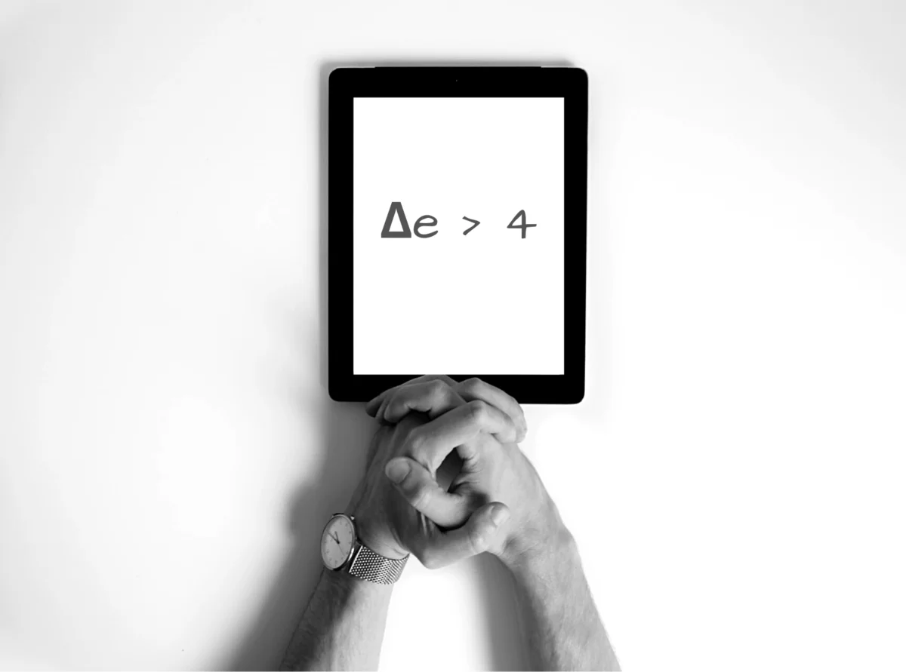



Delta-4 is a theory coined by [Kunal Shah](https://www.linkedin.com/in/kunalshah1), the founder of the [CRED](https://app.cred.club/spQx/49ddd404) app and former founder of Freecharge (acquired by [Snapdeal](https://blog.ipleaders.in/snapdeals-acquisition-of-freecharge/) for $450M), on 'How to evaluate your startup idea?'. It can be used as a framework for self-assessment to evaluate ideas or startups to see whether they are on a path towards creating wealth. This blog post is a summary of some research and notes prepared by me while watching Kunal's talk at the TechSparks Summit. If you prefer watching a video (it's 30 minutes long!) instead of reading this post, [click here](https://www.youtube.com/watch?v=76eNxRSyOyE).



## Efficiency Scoring of an Idea

Since human beings are hacking evolution, all inefficient things are in the past, and efficient things are in the future. Wealth is generated when businesses help humans move from point A to point B in a more efficient manner. This theory can be used to test an idea or an existing business. The efficiency score of a business solution or approach can be represented on a scale of 1-10 by the amount of efficiency it creates. For example, booking tickets via the [IRCTC app](https://www.irctc.co.in/nget/) (Indian Railways official booking platform) can be given a score of 8 or 9, while going to the railway station might score 2 or 3.

## The Delta-4 Theory

> "Every time the Delta of Efficiency is greater than 4, you unlock the pot of gold."  
> — [Kunal Shah](https://twitter.com/kunalb11), Founder of [CRED](https://app.cred.club/spQx/49ddd404)

According to Kunal, if the delta of the efficiencies is greater than 4, the business or solution will unlock the pot of gold. Once the business or product achieves a delta > 4, it becomes unstoppable and turns into a wealth creation machine. Examples include Uber (allowing users to book cabs easily and efficiently), Google (helping users search the web faster), Truecaller (helping identify unknown calls), WhatsApp (making text communication faster, efficient, and free), and more.

## Traits of Delta-4

#### Irreversible

Once Delta 4 has been established, it's impossible for people to go back to the previous state of inefficiency. A person who has booked a flight or train ticket online will never go back to the station or airport to book a ticket again, as Delta 4 has already been achieved.

#### Universal Bragworthy Position (UBP) > Universal Selling Point (USP)

Delta-4 products have a UBP so high that they grow organically without the need for aggressive marketing. One example given by Kunal is Truecaller, which became popular without any advertisements. The product was so good that people were talking about it, and it grew organically.

#### High Tolerance

Once Delta 4 is established, people will have a high tolerance for the product. For example, even if Uber is down for an hour or if a ride gets canceled due to some error, people continue to use Uber. This is contrary to businesses that haven't achieved Delta 4. For example, if purchasing clothes online goes wrong once—say, due to a misfit—people may abandon buying clothes online completely and prefer returning to brick-and-mortar stores.

## Exceptions for Delta-4

#### Affordability

Even if Delta 4 is achieved, if the technology or product is not affordable, wealth cannot be unlocked. For example, people travel by train in India even though flights are far more efficient, as flights are comparatively expensive for the average Indian household.

#### Market Readiness

If a supporting ecosystem is not present in a market, wealth will not be created even when Delta 4 is achieved. An example is introducing a cab booking app in a country where smartphones are not popular. Delta 4 may be achieved by a business offering SMS-based cab bookings until smartphones become more widespread.

#### Learning Effort

If the new business or approach involves a steep or time-consuming learning curve, wealth cannot be unlocked. For instance, a new software designed to replace Tally (commonly used by accountants) may not succeed due to the learning curve involved.

#### Micro-Configurations

The more micro-configurations people have made to an existing product, the more friction there is to adopt a new product. For example, people rarely change operating systems (OS) since adapting to a new OS and making all the necessary micro-configurations can be tedious and time-consuming.

#### Collective Participation

If an existing product already has a large user base, such as WhatsApp, it will be difficult to create momentum for a new product with better features.

#### Branded Lanes or Verbs

When a brand or verb is created to describe a product's function, it becomes challenging to shift people away from it. For example, phrases like "WhatsApp me!" or "Google it!" have become so common that even if a better solution comes along, it will be hard to onboard people to the new product.

## Faking Delta-4

#### Fake Inefficiencies

FMCG companies often create [fake inefficiencies](https://www.business-standard.com/article/companies/fairness-cream-firms-get-innovative-with-marketing-use-synonyms-for-fair-120090201458_1.html) to achieve a Delta-4 state. For example, 50-60 years ago, nobody cared about dandruff or fairness. FMCG companies created this notion to promote their [anti-dandruff shampoos](https://geni.us/rsh-dandruff-shampoo).

#### Influencers

Delta-4 can be faked by using influencers in the market. If an influencer, like a sports star or media personality, endorses a product, people are more likely to adopt it. Similarly, if a large brand uses a particular service or product, smaller brands often follow suit.

#### Piggybacking

Delta-4 can also be achieved by piggybacking on another Delta-4 product. For example, [anti-fog wipes](https://geni.us/rsh-antifog-wipes) for glasses will continue to sell as long as people keep buying spectacles. However, this market will decline once [laser treatments for vision correction](https://www.rebuildyourvision.com/blog/lasik-eye-surgery/is-lasiks-popularity-finally-fading/) achieve Delta-4 and people abandon spectacles.

## How to Evaluate Your Idea?

Delta-4 Theory can be used by entrepreneurs to evaluate startup ideas or existing products. It serves as a framework to assess whether a product or solution is creating extraordinary value and has the potential to generate wealth in the future. Problems are a subset of inefficiencies. This theory can also be used to reverse-engineer existing inefficiencies to find problems—and therefore, potential products.

If you're looking to evaluate an [idea](https://rishikeshs.com/ideas) or your existing business, I believe this article will help in the process. Please [reach out to me][1] if you're trying to analyze your product or business using this theory. I'd love to feature you in a post!


