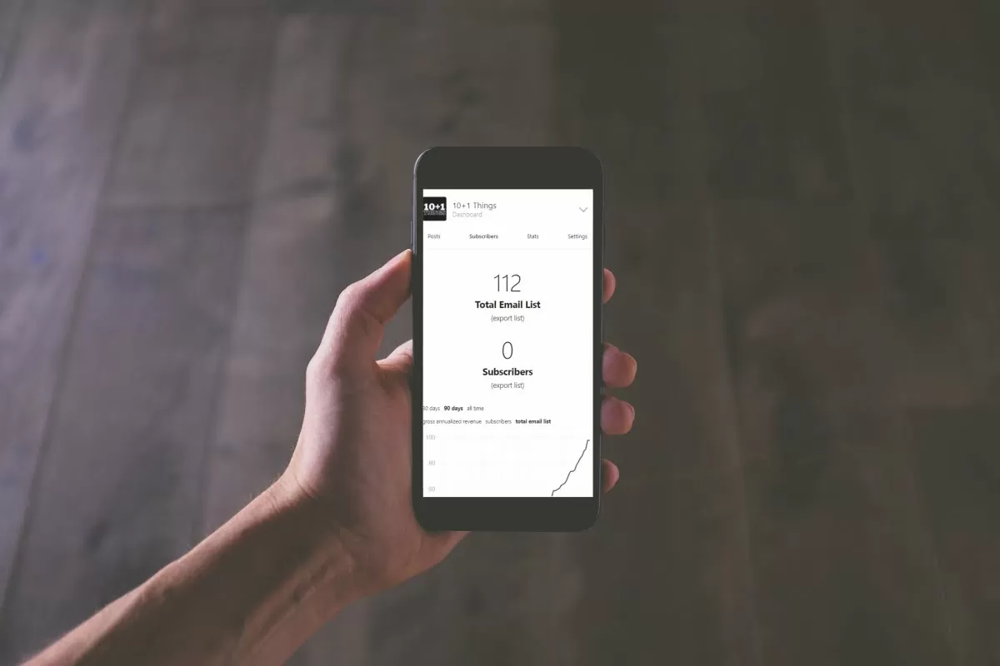

 At the end of May 2021, I started a newsletter called [10+1 Things](https://rishikesh.substack.com/) on Substack. The main idea behind the newsletter was to funnel some traffic to this blog and to other projects I’m working on. In fact, I came up with the name 10+1 Things in 15 minutes and decided to start it on [Substack](https://substack.com/) as it was quick to set up. As I’m writing this, 10+1 Things has just crossed 100+ subscribers. From being a small fun project, the newsletter has grown into a separate project and has become part of my routine. All this happened in just 2 months, and the newsletter is growing strong with a +50% open rate and an expected subscriber count of 300+ by the end of 2021 (I extrapolated the subscriber data!). I started at zero and haven’t spent any money on ads or promotions. All growth has been organic so far, thanks to some cross-promotion with other fellow writers in the community. Here’s what I learned from growing my newsletter from 0 to 100 subs in 2 months: 

## **Just Start!**

I created the first logo using some random font from the internet!

I have always struggled to start. Being a person who cares a lot about design and aesthetics, I usually spend a crazy amount of time tweaking things to launch the perfect product. When I started 10+1 Things, I decided that I was going to start anyway, irrespective of the design or clarity. If you check the initial few issues in the [archive](https://rishikesh.substack.com/archive), you can see that the style was different and not uniform. All I wanted to do was start and write about 11 things every week. Things have changed a lot, and now I have created a [process to optimize the workflow](https://rishikesh.substack.com/about). But I think the reason this newsletter has come so far is that I decided to just start and forget about tweaking small things.

## **Impostor Syndrome**

[Impostor Syndrome](https://www.verywellmind.com/imposter-syndrome-and-social-anxiety-disorder-4156469#:~:text=Impostor%20syndrome%20(IS)%20refers%20to,perfectionism%20and%20the%20social%20context.) is _an internal experience of believing that you are not as competent as others perceive you to be_. I always had problems with Impostor Syndrome and always had the fear of not being good enough. This was one reason that held me back from [starting a blog](https://rishikeshs.com/5-reasons-why-i-decided-to-start-a-blog/) or a [newsletter](https://rishikeshs.com/newsletter/). Even though I overcame it by publishing the first edition, I was reluctant to share it with the public. I was worried that I wouldn’t be good enough and that I would eventually drop it due to inconsistency. Only after I published my second edition did I start sharing the newsletter with friends and the public. One quote by [Derek Sivers](https://sive.rs/obvious) in his book [Anything You Want](https://geni.us/rsh-anythingyouwant) has helped me a lot in this matter: **“What’s obvious to you is amazing to others.”** The book [_Show Your Work_ by Austin Kleon][1] also helped me a lot in overcoming this fear. To everyone who is reading this, my advice would be to just start and forget about others' opinions.

## **Community Matters**

When it comes to newsletters, community matters a lot. I was lucky enough to get good support from my close friends, which encouraged me to continue this journey. Also, Substack has a great community of writers who unite every Thursday for [Writer Hours](https://on.substack.com/p/office-hours-10) to help each other. This sense of community has benefitted me greatly. In terms of numbers, I have done 3-4 cross-promotions with other newsletter writers, which helped me grow the subscriber base. I also have a close-knit group of newsletter creators with whom I often connect for advice and support, and this has contributed a lot to the newsletter’s growth.

## **Developing a Process**

Since [10+1 Things](https://rishikesh.substack.com/) is a newsletter that features [curated content](https://rishikeshs.com/curator-economy/), it involves a lot of effort and time. Over time, I have created a process that helps me identify, collect, and sort important snippets of information that I plan to feature. Newsletter writing has become part of my routine and it inspires me to read and learn throughout the week. Because of this routine, I’m more mindful of consuming information and I weed out unwanted distractions. I’m about to publish the 12th edition, and thanks to the processes and systems I have created, I have reduced the effort of writing each week by at least 30%. If you want to read more about the process I follow, I have written about it on the [about page of my Substack](https://rishikesh.substack.com/about).

Are you a newsletter writer or do you want to start one? I would love to connect with you and discuss more.



[1]: https://rishikeshs.com/show-your-work-by-austin-kleon-book-summary-notes/ "Show Your Work by Austin Kleon: Book Summary & Notes"
