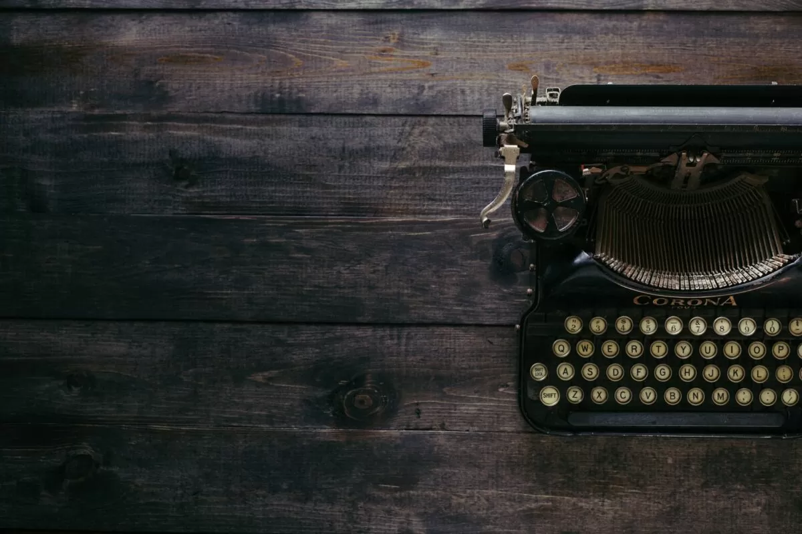


Sometime in mid-2021, I came to know about the idea of the [curator economy](https://rishikeshs.com/curator-economy/) and realized its immense potential in an era where we are struggling with [our attention span](https://rishikeshs.com/attention-diet/). I wanted to create and contribute something to the curator economy space and started a newsletter called [10+1 Things](https://rishikesh.substack.com/), a curated newsletter sharing 11 interesting things catered for generalists. It started as a personal project to keep me on track and commit to a routine, but fast-forward to 2022, the newsletter has close to 2,000 subscribers with excellent engagement. As the newsletter started to grow and gain some attention, I’ve been getting constant queries from people around the world inquiring about how I curate my newsletter. I thought of describing my process in this blog post so that it can be beneficial to others who want to pursue something similar.


## The Structure

Before I start explaining my process, it is important to discuss the structure of my newsletter. I’ve structured my newsletter in such a way that it explores some key areas/topics that I’m exploring in my life and during the week. Every edition of my newsletter follows this structure (it has evolved a bit over time) as described below:

* ✍️ **An article on my blog**: The first link is generally a blog post on this blog. This structure forces me to write at least once every week. This also acts as a funnel for building an audience on my personal blog. Some articles like [this one][1] have been picked by major publications like Hustle!
* 🌍 **Climate/Sustainability**: I care a lot about climate change and sustainability. Thus, I read a lot of articles in this space and share one article surrounding this topic every week.
* 📚 **Books**: I try to read at least one book every week, although this often results in having multiple books to read parallelly. But I love exploring new books every week and thus a new book is shared every week.
* 🧵 **Thread**: Twitter is the only social media I’m active on, and I’m a fan of amazing Twitter threads. Threads do an excellent job in distilling complex information into bite-sized tweets, and I actively look for interesting threads throughout the week. My long-term plan is to write at least one Twitter thread every week, but at the moment, it is not sustainable for me. Thus, I share threads published by other people every week.
* 👩‍🎨 **Artist**: I love art and would love to be known as an artist in the future. This means I need to actively explore other people’s artworks. I share one art project that I’ve been exploring every week.
* 🎬 **Video**: I consume a lot of video content on YouTube/Vimeo every week and try to share some interesting videos every week. This part keeps me mindful about consuming meaningful content, and trust me, it’s quite hard!
* 🧪 **Science**: I try to share some new advancements in science, such as a new invention by researchers or new technology.
* 💡 **Original Thoughts**: This is usually the last and the 11th section of the newsletter and explores an original thought I’m having or some experiment I did. I find a lot of joy in writing this part of the newsletter, and some originals like the newsletter strike system were shared by [Recomendo](https://www.getrevue.co/profile/Recomendo/issues/20-useful-frameworks-job-advice-cooking-meditation-1231157)!
* 🔗 **Other 3 Links**: These are usually quirky or interesting stories or information that I discovered during the week. These links usually have the most engagement in my newsletter.
* 📣 **Shoutouts**: I actively look for cross-promotions with other writers to grow my newsletter. This section includes such shoutouts with a one-liner written by me. Sometimes I include some classified links as well, but this section is restricted to a maximum of 3 links a week.
* 💬 **Quote**: I also share an interesting quote I’ve read throughout the week.

This structure has been consistent for the last couple of months in my newsletter, and I’ve tweaked it after studying data and feedback from users. This consistent structure allows me to define a process to curate this newsletter every week.

## The Sources

Sharing 11 new things every week is no joke and requires a lot of passive effort on my end. This commitment forces me to be aware and mindful of the content I’m consuming and seek out interesting things around the structure of my newsletter. My main information sources for my newsletter are:

* **Newsletters**: These are my major source of information. I subscribe to at least 50+ newsletters and try to keep my inbox clean by spending 30 minutes every day. I follow a process called the newsletter strike system such that my inbox is never full of any junk information. Some of my favorite newsletters are [Farnam Street](https://fs.blog/newsletter/), [Recomendo](https://www.getrevue.co/profile/Recomendo/), [Design Lobster](https://designlobster.substack.com/), [Uncharted Territories](https://unchartedterritories.tomaspueyo.com/), [David Perell](https://perell.com/newsletter/), and [Sunday Snippets](https://aliabdaal.com/newsletter/?utm=rishikeshs.com) by Ali Abdaal.
* **Reddit**: I explore the rabbit holes of information on Reddit and sometimes find very interesting articles there.
* **Hacker News**: I really love the Hacker News community and find a lot of interesting content there that I’ve never seen elsewhere.
* **Twitter**: Twitter also helps me find interesting threads and sources of information. Whenever I read something interesting on Twitter, I research more and usually find even more content by following the trail.
* **YouTube/Video**: I trust YouTube’s recommendation engine to bring me interesting videos every week, even though it has failed multiple times. I tweak my feed by sending the "not interested" feedback. I also closely follow Vimeo’s editors’ picks for interesting documentaries and short films.
* **Recommendation Engines**: [Sample](https://thesample.ai/?ref=things) and [Refind](https://refind.com/?utm_source=newsletter&utm_medium=barter&utm_campaign=2Jnc0y65_WDobSxlPnSu9w) are two recommendation engines that help me find new content and newsletter writers. [Sample](https://thesample.ai/?ref=things) sends a new newsletter every day for me to explore, and [Refind](https://refind.com/?utm_source=newsletter&utm_medium=barter&utm_campaign=2Jnc0y65_WDobSxlPnSu9w) sends a list of interesting articles on the topics I’ve subscribed to!
* **Art Websites**: I subscribe to many art websites, especially photography magazines, so I’m introduced to various contemporary and fine art projects.

Having an extensive list of information sources is easy, but being organized and disciplined about consuming content is the hardest part. Irrespective of the source of information, the ultimate beauty of curation lies within the curator.

## The System

It’s important to have a proper system to collect and store the articles and information I explore from the data sources mentioned earlier. Some articles I find are mostly long-form, and I collect them to read later. I’ve seen others using complex systems built on Notion, spreadsheets, or custom software to track links. But for me, lists work perfectly, and I like to have everything in one space available locally. I use Obsidian as my only personal knowledge management system, and everything I read, consume, and study is stored in it, synced to my iCloud.

A snapshot of my Link Repository

I have various notes in the newsletter section of my Second Brain (aka personal knowledge management system) where I store links as I find them. The notes I use in my system are:

* **Link Repository**: This is where all interesting stories I find go. All links are added at the top so the latest ones are available first. I add a small description to identify the article followed by a link to it. This serves as the main source for curating content for my newsletter.
* **Art Projects**: Every art project I come across goes into this section.
* **Twitter Threads**: Whenever I see an interesting Twitter thread, I store it in this note.
* **Videos**: When I watch an interesting video that resonates with my audience, it is added here.
* **Originals**: Any original thought or idea goes here so that I can refer back to it for my newsletter.
* **Quotes**: All interesting quotes that I read are added here, usually picked up from [Readwise](https://readwise.io/rishikesh/).
* **Misc**: I also use other notes for maintaining my newsletter, such as a working document for the latest edition, a list of newsletter upgrades, and a note to track cross-promotion commitments.

As explained earlier, the process is simple. Every time I read something interesting, I copy the link and collect it in the corresponding note. Since Obsidian is synced to my iCloud, I can access it on both my laptop and my phone.

## The Process

The whole process, from curation to publishing, is described in the following sections:

### Curation

The skeleton I use for drafting.

I use Obsidian to draft my newsletter in Markdown format because I’m comfortable with it and it’s distraction-free. I have a skeleton template that I use to draft new editions every week. This follows the structure of my newsletter and allows me to add various content from my link repository and other sources. By the weekend, I usually finalize all the titles and content for the upcoming edition. Once the sections are frozen, I start to write summaries for each section by researching and verifying the credibility of the articles or information over the weekend or by Monday.

Once the draft is complete, I finalize a title for the newsletter. I usually add numbers in the title (e.g., 40 Concepts or 13 Maps) because this results in the most engagement. All links are added with a UTM tag. I finalize the title and add necessary tags so related notes are linked in Obsidian.

### Formatting

Editing on Hemingway editor. I try to achieve a readability score of 9 or less!

Once the draft is ready, I copy it to the [Hemingway Editor](https://hemingwayapp.com/) for readability and grammar checks using the [Grammarly plugin](https://app.grammarly.com/). Hemingway ensures the sentences are not complicated and that the readability is acceptable. I tweak the recommendations and make necessary changes to grammar. I also use [WordTune](https://www.wordtune.com/) to find synonyms or tweak sentences.

### Publishing

After formatting, I paste the content into the Substack editor for final formatting. I add buttons with corresponding links and spacers between titles. I use an emoji plugin to add an emoji related to each title for visual appeal. I add the current edition number as a subheading with the place of publishing, the temperature, and an indication of the weather with an emoji.

Once formatting is done, I send a test edition to my inbox and review it on both my iPhone and laptop to check for any errors. Once everything looks good, I schedule the newsletter to go out at 5:30 AM IST on Wednesdays. After analyzing engagement, I found this time works best across time zones.

After publication, I usually share the link on Reddit and Twitter after 7-8 hours for additional visibility.

## The Grind

The system I’ve explained in this post is one that I’ve tweaked over a year. What works for me might not work for you, and it’s important to find a system that is frictionless for you. The system evolves over time as I study engagement and analyze data. Regardless, this newsletter has made me 1% better every week, if not every day!

Do you have a newsletter? What system do you use? I’m curious to know more.



[1]: https://rishikeshs.com/man-from-the-future/ "The Man from the Future: A Thought Experiment"

