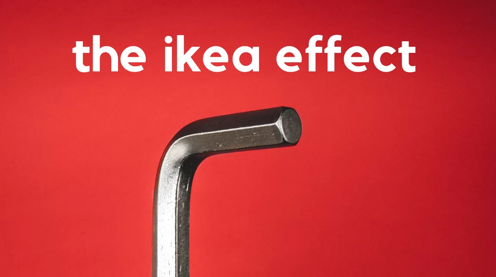


IKEA Effect is a cognitive bias in which we overvalue products that we’ve built or created more than pre-assembled items. The IKEA Effect is the reason why we are in love with LEGO kits and IKEA furniture. It was named after the Swedish manufacturer and furniture retailer that sells furniture items requiring assembly. People’s love for IKEA products was explored by Michael I. Norton, Daniel Mochon, and Dan Ariely in a series of three experiments. The results were published in a paper titled: [The “IKEA Effect”: When Labor Leads to Love](https://www.hbs.edu/ris/Publication%20Files/11-091.pdf).


> They described the IKEA effect as "labor alone can be sufficient to induce greater liking for the fruits of one’s labor: even constructing a standardized bureau, an arduous, solitary task, can lead people to overvalue their (often poorly constructed) creations."

IKEA Effect can be observed in many real-life examples like:

  * When instant cake mixes were introduced in the 1950s to simplify life, American housewives were reluctant to buy them because it made cooking too easy. Manufacturers had to change the recipe to require adding an egg to improve sales.
  * Subway is popular because it gives people the feeling that they are making their own sandwich and allows for customization.
  * People are willing to pay a premium for apple-picking experiences, even though the actual cost of apples is less.
  * Many distilleries and breweries offer factory tours that allow customers to make their own beer or whiskey, charging a hefty amount for the experience.
  * Haycations are popular in some parts of the world, where people come to harvest produce from farms during holidays.
  * Kids tend to like and eat more vegetables if they are involved in the cooking process.
  * From shoes to toys, many manufacturers allow some form of customization, triggering the IKEA Effect and increasing sales.
  * Some animals, such as rats and starlings, prefer to eat food from sources that required effort on their part.

Source: [Sketchplanations](https://sketchplanations.com/the-ikea-effect)

In the study, a series of experiments were conducted by the researchers among a group that was split into two groups. I read the paper and have tried to distill the results below:

In the first experiment, participants were split into builders and non-builders. Builders were asked to assemble an IKEA storage box themselves using instructions, while the non-builders were told to inspect an already assembled similar storage box. Afterward, the participants were told to bid a price for the product. The builders’ group valued the product more than the non-builders, even though the product was the same.

In the second experiment, builders were asked to make an origami frog or crane using instructions. Builders were asked to bid a price at which they would buy back these origami creations. Non-builders were told to bid a price on these creations made by builders, as well as on professionally made origami creations. The results indicated that the builders’ bids for their own creations were high, as they wanted to avoid losing their creation. Builders' bids were close to the price bid by non-builders for expert origami creations.

In another experiment, the group was split into builders and incomplete builders. Builders were allowed to assemble an IKEA product, but incomplete builders were not allowed to finish assembling the product, even though they had all the pieces. As expected, the bid prices of builders were significantly higher than those of incomplete builders.

These results indicate the magnitude and extent to which the IKEA Effect can influence our decisions. If you’re interested, you can read the [detailed study here](https://www.hbs.edu/ris/Publication%20Files/11-091.pdf).

I’m new to this concept, and this post is a working document. I’ll update it with more information as I discover more examples of the IKEA Effect. Nevertheless, it is an excellent cognitive bias that can be used by marketers and engineers to craft products that sell organically by leveraging this bias.


