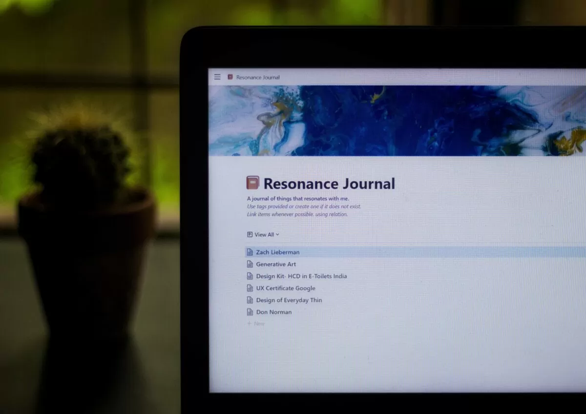


I came to know about the concept of Resonance Journal when I watched Ali Abdaal’s video on how he uses [Notion for keeping his resonance calendar](https://www.youtube.com/watch?v=lKYBB-Uw1IM). After watching the video, I felt like the term ‘Resonance Calendar’ was not apt for what I wanted to achieve. I decided to rename it as [Resonance Journal](https://dent-radar-d40.notion.site/2615af7fb932434c9085b4c666781d20?v=089ad185b9354ae49ab8b26ef844a214) and set up one similar to Ali on Notion. I currently use the Resonance Journal as a tool in my journey towards self-discovery.


> Anytime I come across anything at all that resonates with me, I drop it into the Resonance Calendar on Notion. This lets me keep track of articles I’ve read, YouTube videos I’ve watched, books and podcasts I’ve listened to, and anything else I come across in life.
>
> — [Ali Abdaal](https://aliabdaal.com/using-notion-as-a-resonance-calendar/)

## How does it work?

How an entry looks in Resonance Journal

The concept is simple. Every time you come across a video, podcast, job, article, book, project, etc., that resonates with you, add it as an entry to the Resonance Journal. Use the existing tags or create one if it doesn’t exist. Over time, you will notice patterns or common threads of things that resonate with you. Some items often resonate with you and have multiple entries in the journal. For example, I came across articles, blogs, and personalities centered around human-centered design a lot in my journal. Interestingly, there were very few entries related to renewable energy, which was my major! 🙂



## Self-Discovery using Resonance Journal

I have always struggled with figuring out what I wanted to do in life. I’ve always wanted to work on something I’m truly passionate about, especially in terms of a career since it occupies a major part of life. Journaling about things that resonate with me has positively impacted my self-discovery journey. I realized that what I thought mattered to me or what I thought fit me wasn’t always something I had a true connection with. Through this process, I found interesting patterns and repeatedly encountered multiple personalities in different contexts. 

At the time of writing this, I’m currently doing a program on Design Research by the [Interaction Design Foundation (IDF)](https://www.interaction-design.org/invite?r=rishikesh-2). This is something I discovered after journaling for a few months in the Resonance Journal. I noticed several instances where I felt deeply connected to design research, such as works by [IDEO](https://www.ideo.com/), [Acumen Academy](https://acumenacademy.org/), [Space10](https://space10.com/), and [Don Norman](https://en.wikipedia.org/wiki/Don_Norman). Every time I read about something related to UX, like design research or interaction design, I felt a strong connection and was excited to learn more. What’s funny is that these were the same topics that excited me two years ago, but I dismissed them as mere curiosity cravings. I don’t know if this is the right or wrong path, but I’m happy to pursue something that resonates with me rather than doing something accidentally.

You can check out my sample Resonance Journal using the link below.



What do you think of Resonance Journaling? Does it make sense to you? If you’re into journaling, check out my article on [stress journaling](https://rishikeshs.com/stress-journal/).

I would love to hear your thoughts in the comments or [message me directly](https://rishikeshs.com/contact/).


