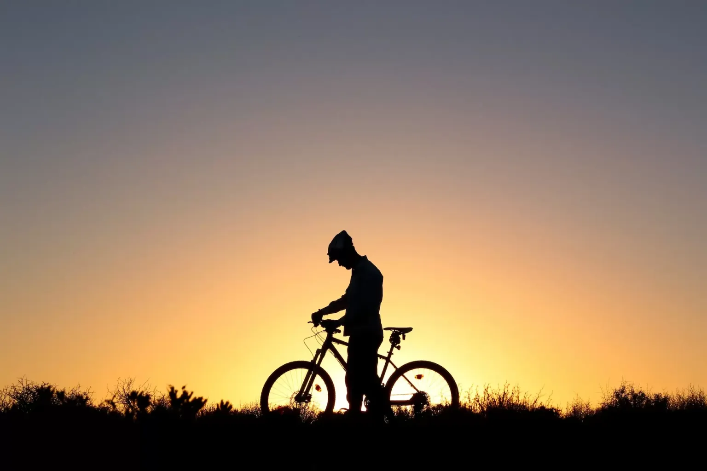



When I shared my [2022 review](https://rishikeshs.com/2023-plan/ "2023: A Year of Execution"), I mentioned that becoming a 'Super Randonneur' was one of the best things that happened last year. After publishing the blog post, I received a few messages from readers asking about the same, and I thought of jotting down my experiences in this blog post. To start with, [Randonneuring](https://en.wikipedia.org/wiki/Randonneuring "Randonneuring") is a long-distance cycling sport that originated in France. It is characterized by self-supported endurance rides that cover distances of 200 kilometers or more, called brevets (BRM). Riders typically participate in organized events that follow a predetermined route and have time limits for completion. The goal is to complete the ride within the time limit, rather than racing against other riders. In my opinion, randonneuring is more or less a race against yourself.



## The Why

As mentioned earlier, the goal of randonneuring is to complete the required distance within the time limit and is not a race against other participants. There are no podium prizes for people who complete first, and it's all about completing the ride within the timeframe. Riders are meant to be self-sufficient, and there are no support crews or vehicles involved. [Audax Club Parisien (ACP)](https://en.wikipedia.org/wiki/Audax_Club_Parisien "Audax Club Parisien (ACP)") is the international governing organization for randonneuring and oversees the conduct of BRMs by various clubs around the globe.

Super Randonneur is a title awarded to cyclists by ACP who complete a series of BRMs within a calendar year. The series includes four brevets of varying distances: 200km, 300km, 400km, and 600km with cut-off times of 13.5, 20, 27, and 40 hours respectively. All these have to be completed in a calendar year by Audax, i.e., from November 1st to October 31st. I always had the goal of becoming a Super Randonneur (SR) but never intended to do it in 2022. My goal for 2022 was to complete a 200 and 300 BRM, but due to the support from my cycling clubs and inspiration from others, I decided to go for it and somehow achieve it. Becoming an SR is not about completing the distance or earning a title, but is about the journey and the experience of pushing yourself to limits you never imagined. It's about the camaraderie and sense of accomplishment that comes with overcoming unexpected challenges on the road. I enjoyed each and every moment during the journey and was often astonished by the results we can achieve if we have control of our minds.

## My Experience

Last year, I was living in Kerala, India, and participated in BRMs organized mainly by Cochin Biker's Club and Trivandrum Biker's Club. I was fortunate and lucky enough to ride with an amazing community of people around me and enjoyed all these rides to the core. BRMs are those times when you ride without any fear of calories and eat as much as you want!

Strava activity map of my 300km BRM ride.

My [first BRM was a 300km](https://www.strava.com/activities/7298711709 "first BRM was a 300km ") one that was organized by Cochin Biker's Club on June 12th, 2022. It was a fairly easy route with limited elevation, but the only issue was the onset of monsoons and bad roads. I was riding with my club mates from my local cycling club, Cherthala Cycling Club (CCC), and reached halfway at a pretty decent pace despite the scorching heat of the sun. On our way back, it was raining continuously and we had to ride in wet clothes with no mudguard or fenders for at least 4-5 hours if I remember correctly. The roads were bad but nevertheless, we all completed the ride without any punctures or injuries. I was able to complete the ride in 18 hours, 2 hours before the cut-off time.

Strava activity map of my 400km BRM ride.

After the 300km ride, I was supposed to complete a 400km ride earlier, but couldn't participate as my friend was injured in an accident. So after 3 months since I completed the 300 BRM, I signed up for the 400 BRM on September 10th by Cochin Biker's club. The route was fairly easy but had some elevation at one stretch and crazy headwinds. Before this, I had never ridden in heavy headwind conditions, but some of my co-riders had mentioned how hard it was when they attempted it earlier. To make things worse, I was recovering from flu and had never attained full fitness, but this was my only chance to complete the 400 BRM as the calendar year was coming to a close. I decided to go for it by taking a paracetamol tablet and taking a call later in the day if things got worse. The headwinds were crazy during the Palakkad stretch of the ride and I remember pedaling hard to move on a downhill stretch. This was also the first time I experienced sleeplessness as I was very tired during the last 150 km after midnight. Nevertheless, we all pushed ourselves and completed the ride successfully in 24 hours and 20 minutes. It was a great example of teamwork and how we pushed ourselves.

Strava activity map of my 200km BRM ride.

With just one month left for the calendar year to close and my plans for shifting to Delhi, I had no choice but to attempt the 200km BRM at Trivandrum. It was titled 'Lord of the Winds' because of the crazy head and crosswinds in the route. The route stretched from Trivandrum in Kerala to Kanyakumari, the southern tip of India, and back. Within the 1st hour of the ride, somehow my pedal got loose and I was left alone with no choice as I had no spanner to tighten the pedal in the early hours of the day. I almost decided to quit the ride, but luckily I met a mechanic randomly who helped me. With this lifeline, I was determined to complete the race by giving my best. The route was very difficult and we had to pass through an area filled with wind power plants. It was so windy that I had to slow down and stop at a point to ensure that I didn't crash because of the crosswinds. It was a tough ride since I was riding alone with no mates and somehow completed it in 12 hours.

Strava activity map of my 600km BRM ride.

With one week left to shift to Delhi, this was my last chance to become a Super Randonneur at my home place. I decided to give my best and rode with a teammate from my local club. The ride stretched from Kochi to Kanyakumari and back. I was a bit confident and scared about the last windy stretch which I had already ridden 2 weeks before this ride. The ride started smoothly and we reached the halfway mark without much drama despite the crazy rolling terrain we had to ride through. On my way back, I received a call from my clubmate and he had a puncture on his rear tire. I had already reached the checkpoint and punched my card, but decided to go back and help since he had no pump. I went back and helped him, and started the ride ahead as time was running out. I had 4 hours left to reach the next checkpoint which was 108 km away. This would have been pretty easy for me any other day, but since I was already exhausted riding 400 km, this was a tough task ahead. I had no time to eat or drink and decided to carry two bottles of water and a packet of cookies to consume while riding. The next 4 hours felt like an eternity and I had never pushed myself like this in my entire life. I rode non-stop for the next 4 hours, not stopping as I had no luxury of time. At times, I felt like tripping due to exhaustion and lack of proper sleep. Somehow I reached the checkpoint 2 minutes before the cut-off time and eventually ended up completing the ride and became a Super Randonneur. My friend whom I had mentioned earlier had to quit since he had a few more punctures and was not able to make it. The sense of accomplishment and the high feeling when I completed was something I cannot describe in words.

The Super Randonneur certificate from AUDAX India

## Learnings

The journey to becoming a super randonneur is a hard one and it teaches you a lot of hard lessons that you never imagined. If you ask me it's about 50% determination, 30% hard work, and 20% luck. Following are some lessons I learned during this journey:

* **Mastering Luck:** Luck plays a major role in such events in my opinion. Since it is a self-sufficient ride, you might face challenges you never imagined. My first BRM was a disaster since I had 2 punctures before the race started and my pump ran out of battery. Punctures are something that you cannot avoid and accidents may happen. My pedal went off during the 200 BRM and I was stuck on the road for almost an hour. The only way to have luck on your side is to put in the hard work and weed out all possibilities that can affect your ride. I learned that it is essential to plan and prepare for the ride, not just in terms of the route but also in terms of the gear, food, and other necessities. Carry all the essentials that you need if you have to repair your bike and ensure that you've tested and used all your accessories beforehand. I made the mistake of carrying a battery-operated air pump in my first BRM and ended up quitting it since I had no charge left. Learn everything about your bike and learn to fix most of the issues while on the road. Ride as much as possible and face these unfortunate events and eventually, you will master luck.

* **Power of Mind:** The brevets are not only physically challenging but also mentally challenging. I learned that a strong mind is just as important as a strong body when it comes to completing the journey. 600 BRM taught me a lesson that if you have determination, you can push your limits to the extent you never thought of.

* **The importance of camaraderie:** The journey to becoming a Super Randonneur is not a solo endeavor. I learned that the camaraderie and support of other riders are essential. The sense of community and shared experience is one of the most rewarding aspects of the journey. My clubmates were in constant touch with me with all support and this encouraged me to complete the rides despite the hard moments.

* **The value of patience:** The brevets are not races, and the goal is not to finish as quickly as possible. I learned that patience is essential when it comes to completing the journey. It's about enjoying the ride and not getting caught up in the rush to finish. I really love those phases where you are lost in the flow of riding and enter a trance state of mind!

* **The beauty of the open road:** One of the most rewarding aspects of being a Super Randonneur is the chance to explore the beautiful landscapes and roads that this journey offers. I learned that the open road is not just a place to ride but also a place to discover and appreciate the beauty of nature. I always look for trying out new food and culture, especially on these long rides.

* **The importance of self-care:** The journey to becoming a Super Randonneur is demanding, both physically and mentally. I learned that taking care of oneself is essential, not just during the ride but also before and after. During the ride, my golden rule is to eat before I feel hungry and drink before I feel thirsty. Post-ride, I prefer a protein-rich diet and go for long walks for recovery. Also, a deep-tissue massage helps in reducing the soreness in your muscles.

## Way Forward

It's been 3 months since I became a 'Super Randonneur'. I do not ride much these days as I shifted to New Delhi, thanks to the crazy pollution and extreme weather. I'm looking forward to connecting with new clubs here and riding a few BRMs this year. I would love to become a Super Randonneur again but I do not see it happening this year. In terms of a long-term goal, here are some that I look forward to completing in a few years:

* I want to complete at least 2 LRMs in India. LRMs are rides that span over 1000 km and are 2X tougher than the 600km BRM. I look forward to completing these in the near future.

* Paris-Brest-Paris (PBP) is a long-distance cycling event that takes place every four years. It is organized by Audax Club Parisien (ACP) and is considered one of the most prestigious randonneuring events in the world. The event is a 1200 km (750 miles) non-stop, non-competitive ride that starts and finishes in Paris, France. The route goes through the beautiful countryside of France, and riders must complete the distance within a time limit of 90 hours. I plan to attend the event in 2027!

* London Edinburgh London (LEL) is a long-distance cycling event that takes place every four years. It is organized by Audax UK, a randonneur cycling organization based in the United Kingdom. The event is a 1400 km (870 miles) non-stop, non-competitive ride that starts and finishes in London, UK. The route goes through the beautiful countryside of England, Scotland, and Wales, and riders must complete the distance within a time limit of 96 hours. I plan to participate in 2026 if everything goes well.

These are distant goals but require dedication and practice. If everything goes well in terms of health and finances, I look forward to completing these in the coming years. Even if I don't, this is something I look forward to and keeps me motivated.





