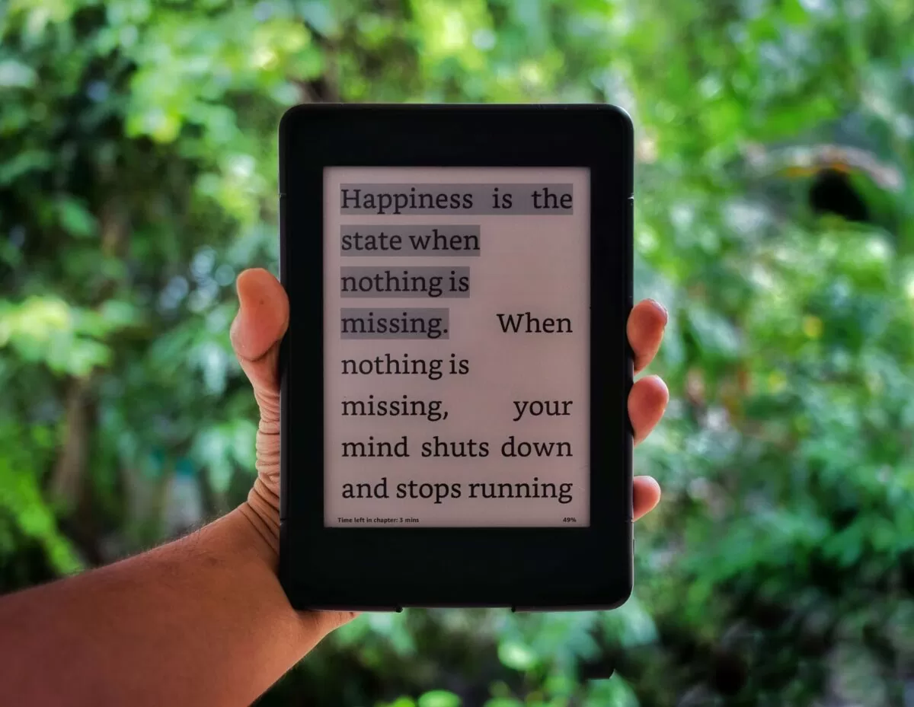

 Naval Ravikant, often called the ['Angel Philosopher'](https://theangelphilosopher.com/), is one of the greatest thinkers and entrepreneurs of this generation. [Naval](https://nav.al/) has this amazing ability to distill big, universal ideas and philosophies into bite-sized [Twitter tweets](https://twitter.com/naval). The book, ['The Almanack of Naval Ravikant: A Guide to Wealth and Happiness'](https://www.navalmanack.com/), is a collection of Naval's wisdom from Twitter, podcasts, and essays over the past decade. The author of the book, [Eric Jorgenson](https://www.ejorgenson.com/), created a Twitter poll asking the audience whether he should compile Naval's tweets into a book. The tweet went viral and was retweeted by Naval himself. That's [how this book came into shape](https://www.navalmanack.com/blog-posts/how-this-book-came-together-entirely-on-twitter). If you follow Naval on [Twitter](https://twitter.com/naval) or through other podcasts, the ideas in this book won’t be new to you. 

  

    <a class="wp-block-button__link" href="https://geni.us/rsh-naval-ravikant" target="_blank" rel="noreferrer noopener">BUY ON AMAZON</a>
  

## How the book changed me?

Naval's life philosophy resonates with me a lot, and this book strengthened that connection. His ideas and his vision towards life had a huge impact on me, making this one of the [best books I’ve read](https://rishikeshs.com/about/). His views on judgment and leverage have been very influential to me. This is one book I revisit multiple times a year, usually by opening a random page and reading his ideas to get a fresh perspective.

## Key Notes

- Happiness is a skill to develop and a choice we make. The idea that achieving something external will make us happy is a delusion. Happiness is a choice and can be controlled. The state of happiness is reached when you're content with what you have.
- Sugar + Fat is a deadly combination and doesn’t occur naturally in whole foods.
- The Power of Leverage

## Favorite Quotes from the book

> I read out of curiosity and interest.

> The fundamental delusion: There is something out there that will make me happy and fulfilled forever.

> I think the smartest people can explain things to a child.

## Highlights from Kindle

- Seek wealth, not money or status. Wealth is having assets that earn while you sleep. Money is how we transfer time and wealth. Status is your place in the social hierarchy.
- You’re not going to get rich renting out your time. You must own equity—a piece of a business—to gain your financial freedom.
- Learn to sell. Learn to build. If you can do both, you will be unstoppable.
- Specific knowledge cannot be taught, but it can be learned.
- Most of life is a search for who and what needs you the most.
- "All the returns in life, whether in wealth, relationships, or knowledge, come from compound interest."
- Intentions don’t matter. Actions do. That’s why being ethical is hard.
- An old boss once warned: "You’ll never be rich since you’re obviously smart, and someone will always offer you a job that’s just good enough."
- If someone is talking a lot about how honest they are, they’re probably dishonest.
- I think the smartest people can explain things to a child.
- The really smart thinkers are clear thinkers.
- The number one thing clouding us from being able to see reality is we have preconceived notions of the way it should be.
- Facebook redesigns. Twitter redesigns. Personalities, careers, and teams also need redesigns.
- The moment you tell somebody something dishonest, you’ve lied to yourself.
- Happiness is the state when nothing is missing.
- If I say I’m happy, that means I was sad at some point.
- It’s about the absence of desire, especially the absence of desire for external things.
- You’re born, you have a whole set of sensory experiences and stimulations (lights, colors, and sounds), and then you die.
- Happiness is what’s there when you remove the sense that something is missing in your life.
- The fundamental delusion: There is something out there that will make me happy and fulfilled forever.
- Happiness is being satisfied with what you have.
- You can get almost anything you want out of life, as long as it’s one thing and you want it far more than anything else.
- You’re born alone. You’re going to die alone. All of your interpretations are alone. All your memories are alone.
- Do you want to be the world’s best lover and known as the worst, or the world’s worst lover and known as the best?
- One day, I realized with all these people I was jealous of, I couldn’t just choose little aspects of their life.
- If you’re not willing to do a wholesale, 24/7, 100 percent swap with who that person is, then there is no point in being jealous.
- Once I came to that realization, jealousy faded away because I don’t want to be anybody else. I’m perfectly happy being me.
- When it comes to medicines for the mind, the placebo effect is 100 percent effective.
- At the end of the day, you are a combination of your habits and the people who you spend the most time with.
- Many distinctions between people who get happier as they get older and people who don’t can be explained by what habits they have developed.
- We should be two monkeys sitting in the jungle right now watching the sun going down, asking ourselves where we are going to sleep.
- The most important trick to being happy is to realize happiness is a skill you develop and a choice you make.
- It’s the news’ job to make you anxious and angry. But its underlying scientific, economic, education, and conflict trends are positive. Stay optimistic.
- “What is the positive of this situation?”
- Fundamentally, it boils down to one big hack: embracing death.
- Death is the most important thing that is ever going to happen to you.
- Certainly, listen and absorb, but don’t try to emulate.
- The combinatorics of human DNA and experience are staggering. You will never meet any two humans who are substitutable for each other.
- Nothing like a health problem to turn up the contrast dial for the rest of life.
- Outside of math, physics, and chemistry, there isn’t much “settled science.”
- If you eat a fatty meal and throw some sugar in, the sugar is going to deliver hunger, and fat is going to deliver the calories, and you’re just going to binge.
- Why all desserts are large combinations of fat and carbs together.
- In nature, it’s very rare to find carbs and fat together.
- The combination of sugar and fat together is really deadly.
- World’s simplest diet: The more processed the food, the less one should consume.
- “Easy choices, hard life. Hard choices, easy life.”
- If you make the easy choices right now, your overall life will be a lot harder.
- Your body saying it’s cold is different from your mind saying it’s cold.
- Meditation is intermittent fasting for the mind.
- Choiceless Awareness, or Nonjudgmental Awareness.
- Life-hack: When in bed, meditate. Either you will have a deep meditation or fall asleep. Victory either way.
- “The Attraction for Drugs Is Spiritual.”
- I just want to be the most successful version of myself while working the least hard possible.
- Applied science becomes technology, and technology is what separates us from the animals and allows us to have things like cell phones, houses, cars, heat, and electricity.
- The returns in life are being out of the herd.
- Mathematics is us reverse engineering the language of nature, and we have only scratched the surface.
- Courage is not caring what other people think.
- Understanding the long-term consequences of your actions.
- The democratization of technology allows anyone to be a creator, entrepreneur, or scientist. The future is brighter.
- I read out of curiosity and interest.
- Forget rich versus poor, white-collar versus blue. It’s now leveraged versus un-leveraged.



