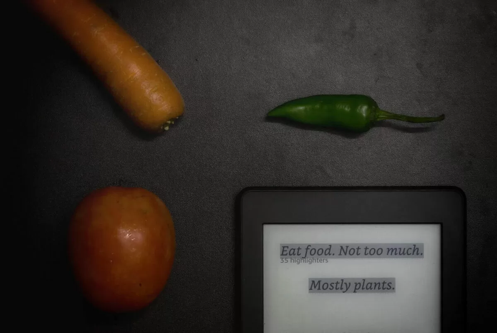


[Food Rules: An Eater’s Manual](https://geni.us/rsh-food-rules) is a tiny book by [Michael Pollan](https://michaelpollan.com/). I came to know about the book from [Derek Siver’s website](https://sive.rs/2do) and thought of reading this. The book distills Pollan’s wisdom of food and diet into 64 simple rules for eating healthily and happily. The book is small and I finished it in less than an hour. Many ideas discussed in the book might already be known to you. The basic idea of the book is “eat what your grandmother or your ancestors would recognize as food.” The book is divided into three parts: What should I eat?, What kind of food should I eat?, and How should I eat? Pollan does not discourage us from eating something unhealthy once in a while but suggests avoiding processed food as much as possible. The whole book can be distilled into seven words:


> Eat food. Not too much. Mostly plants.
>
> — [Michael Pollan](https://geni.us/rsh-michael-pollan)

This book is a must-read if you are looking to get some insights on diet and leading a healthy lifestyle.



## How the book has changed me?

As mentioned earlier, many [ideas](https://rishikeshs.com/ideas) were already known to me. But the book brought more clarity to my stance against processed food. The French Paradox mentioned in the book was also thought-provoking. The practice of having a colorful diet backed up by the idea of phytochemicals was new to me. I have also decided to include fermented food at least in one meal per week after reading about its benefits.

## Key Notes

- An ideal diet consists mainly of plant-based ingredients as less processed as possible. The more processed and longer the shelf life of products, the less nutritious they are.
- Any food that contains added sugar is harmful to health.
- Eat whole foods and try to avoid liquid food as much as possible.
- Humans are one of the few mammals who consume calories via liquid foods after weaning.

## Favorite Quotes from the book

- The healthiest food in the supermarket—the fresh produce—doesn’t boast about its healthfulness because the growers don’t have the budget or the packaging.
- French paradox: the mystery (at least to nutritionists) of a population that eats all sorts of supposedly lethal fatty foods and washes them down with red wine but is nevertheless healthier, slimmer, and slightly longer-lived than we are.
- The whiter the bread, the sooner you’ll be dead.

## Highlights from Kindle

- Populations that eat a so-called Western diet—generally defined as a diet consisting of lots of processed foods and meat, lots of added fat and sugar, lots of refined grains, lots of everything except vegetables, fruits, and whole grains—invariably suffer from high rates of the so-called Western diseases: obesity, type diabetes, cardiovascular disease, and cancer.
- Eat food. Not too much. Mostly plants.
- Don’t eat anything your great-grandmother wouldn’t recognize as food.
- Today, foods are processed in ways specifically designed to get us to buy and eat more by pushing our evolutionary buttons—our inborn preferences for sweetness, fat, and salt. These tastes are difficult to find in nature but cheap and easy for the food scientist to deploy.
- Avoid food products containing ingredients that no ordinary human would keep in the pantry.
- Avoid food products that contain high-fructose corn syrup.
- Avoid foods that have some form of sugar (or sweetener) listed among the top three ingredients.
- The healthiest food in the supermarket—the fresh produce—doesn’t boast about its healthfulness because the growers don’t have the budget or the packaging.
- The more processed a food is, the longer the shelf life, and the less nutritious it typically is. Real food is alive—and therefore, it should eventually die.
- Eat foods made from ingredients that you can picture in their raw state or growing in nature.
- If it came from a plant, eat it; if it was made in a plant, don’t.
- By eating a diet that is primarily plant-based, you’ll be consuming far fewer calories since plant foods—with the exception of seeds, grains, and nuts—are typically less energy-dense than other foods.
- Vegetarians are notably healthier than carnivores and live longer.
- “Eating what stands on one leg (mushrooms and plant foods) is better than eating what stands on two legs (fowl), which is better than eating what stands on four legs (cows, pigs, and other mammals).”
- The colors of many vegetables reflect the different antioxidant phytochemicals they contain—anthocyanins, polyphenols, flavonoids, carotenoids. Many of these chemicals help protect against chronic diseases, but each in a slightly different way, so the best protection comes from a diet containing as many different phytochemicals as possible.
- Eat animals that have themselves eaten well.
- The dazzling diversity of food products on offer in the supermarket is deceptive because so many of them are made from the same small handful of plant species, and most of those—the corn, soy, and wheat—are seeds rather than leaves.
- The fields and forests are crowded with plants containing higher levels of various phytochemicals than their domesticated cousins. Why? Because these plants have to defend themselves against pests and diseases without any help from us. We’ve also selected and bred crop plants for sweetness; many defensive compounds that plants produce are bitter. We also breed for shelf life, which has reduced levels of omega-3 fatty acids in plants, as these fats quickly oxidize—turning rancid.
- Humans are one of the few mammals that obtain calories from liquids after weaning.
- “The whiter the bread, the sooner you’ll be dead.”
- People who eat lots of whole grains tend to be healthier and live longer.
- Cultures that took corn from Latin America without the beans or the lime ended up with serious nutritional deficiencies such as pellagra.
- French paradox: the mystery (at least to nutritionists) of a population that eats all sorts of supposedly lethal fatty foods and washes them down with red wine but is nevertheless healthier, slimmer, and slightly longer-lived than we are.
- The American food system has for many years devoted its energies to increasing quantity and reducing price rather than improving quality.
- As the cost of food in America has declined, in terms of both price and effort required to put it on the table, we have been eating much more (and spending more on health care).
- Eat when you are hungry, not when you are bored.
- If you are going to snack, try to limit yourself to fruits, vegetables, and nuts.
- Some people follow a so-called S policy: “no snacks, no seconds, no sweets—except on days that begin with the letter S.”




