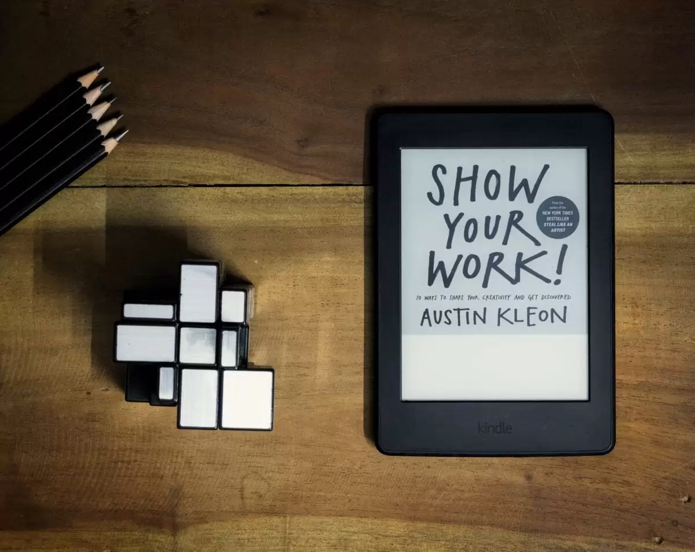

 [Show Your Work](https://geni.us/rsh-ShowYourWork) by Austin Kleon is the main reason [why I started this blog](https://rishikeshs.com/5-reasons-why-i-decided-to-start-a-blog/). Through the book, [Austin](https://austinkleon.com/) teaches people how to think about their work as a never-ending process that attracts like-minded people. It explains why you don’t have to be a genius to present your ideas to the world. It stresses the importance of having a personal blog to share your ideas and how it will transform into a self-invention machine. It’s a must-read manual for anyone who is slightly interested in creativity or entrepreneurship in this digital age. 



## How the book changed me?

The book completely changed me and my thought process of sharing stuff online. I’m now more comfortable putting my thoughts online and have more confidence in talking about my work in public. As mentioned earlier, I started this blog inspired by this book and became a keen follower of [Austin’s blog](https://austinkleon.com/). In fact, the newsletter I run on this blog, [10+1 Things](https://rishikesh.substack.com), was also inspired by his newsletter. Currently, I’m reading Austin’s other book titled *How to Steal Like an Artist*.

## Keynotes

- Sharing your thoughts, processes, and work online for free does more than you can imagine. Think of your website as a machine for self-discovery.
- Being an amateur is one of the greatest things, and you don’t need to be an expert to share your work. Never wait to become an expert to show your work (this has happened many times with me). It’s all about taking that first step and just doing it.
- Sharing your work online actually attracts a tribe who care about or connect with the stuff you are working on. This audience would be interested in your thoughts and the process you followed for the project.
- Document everything you have done using photos, notes, videos, etc.

## Favorite Quotes

> Don’t think of your website as a self-promotion machine, think of it as a self-invention machine.

> If you’ve just completed a project, show the final product, share scraps from the cutting-room floor, or write about what you learned.

> But whatever the nature of your work, there is an art to what you do, and there are people who would be interested in that art, if only you presented it to them in the right way.

> Overnight success is a myth.

## My Kindle Highlights

- Great ideas are often birthed by a group of creative individuals—artists, curators, thinkers, theorists, and other tastemakers—who make up an “ecology of talent.”
- “In the beginner’s mind, there are many possibilities,” said Zen monk Shunryu Suzuki. “In the expert’s mind, there are few.”
- The real gap is between doing nothing and doing something.
- Even for professionals, the best way to flourish is to retain an amateur’s spirit and embrace uncertainty and the unknown.
- Obituaries are like a near-death experience for cowards.
- Reading about people who are dead now and did things with their lives makes me want to get up and do something with mine.
- Whether you share it or not, documenting and recording your process as you go along has its own rewards: You’ll start to see the work you’re doing more clearly and feel like you’re making progress.
- Once a day, after you’ve done your day’s work, go back to your documentation and find one little piece of the process that you can share.
- If you’ve just completed a project, show the final product, share scraps from the cutting-room floor, or write about what you learned.
- “Dumpster diving” is one of the jobs of the artist—finding the treasure in other people’s trash, sifting through the debris of our culture, paying attention to the stuff that everyone else is ignoring, and taking inspiration from the stuff that people have tossed aside.
- Attribution is all about providing context for what you’re sharing: what the work is, who made it, how they made it, when and where it was made, why you’re sharing it, why people should care about it, and where people can see more work like it.
- Don’t share things you can’t properly credit. Find the right credit, or don’t share.
- “Personal stories can make the complex more tangible, spark associations, and offer entry into things that might otherwise leave one cold.”
- If you want to be more effective when sharing yourself and your work, you need to become a better storyteller.


