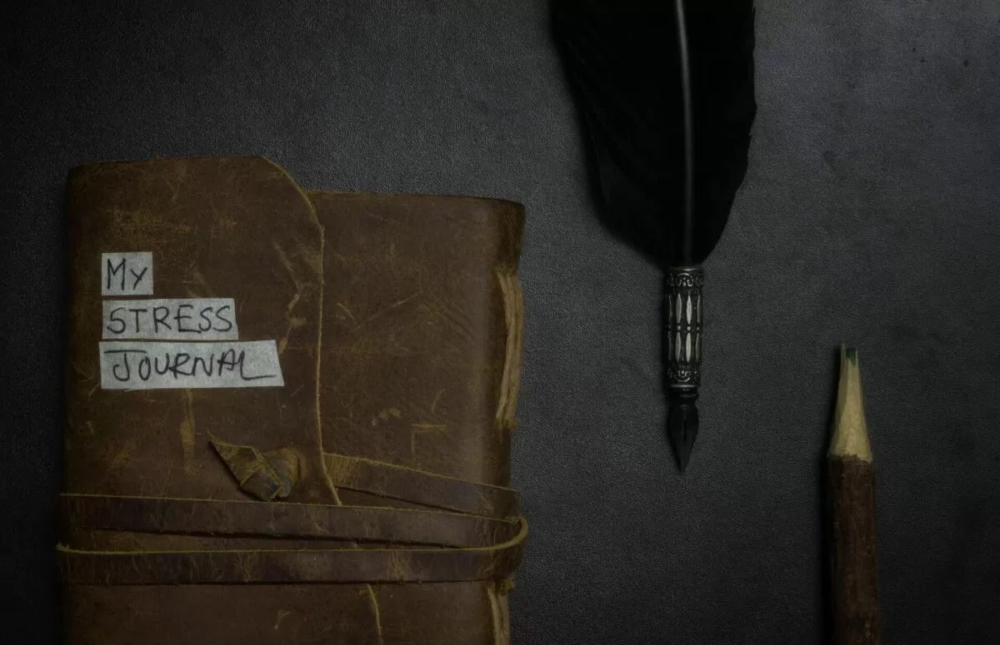

 I started journaling when the second wave of Covid-19 hit India in April 2021. I’m not a daily journal person, though I would like to make it a daily habit. I journal my thoughts occasionally on Obsidian in digital format using Markdown. I also maintain an [Idea Journal in public](https://rishikeshs.com/idea-journal/), a [resonance journal in Notion](https://rishikeshs.com/resonance-journal/), and a private art journal in [Obsidian](https://obsidian.md). The only journal I write in physical form is my **Stress Journal**. I’m not sure where I got the idea, but I think I read about it on [Twitter](https://twitter.com/rishikeshshari) (I wish I knew the source so I could credit it). If you don’t know what journaling is, it’s a self-practice where you record your thoughts and emotions in a diary, whether digital or physical. 

> Do you know what’s common between Albert Einstein, Anne Frank, Marie Curie, Frida Kahlo, Leonardo da Vinci, and Frederick Douglass? They all kept journals.
> 
> — Source: [Mintexports](https://mintexports.com/blogs/blog/handbags2)

This is how entries will look in a stress journal

The idea of a stress journal is simple. Anytime you face anxiety or stress, write the date and describe the feeling and what triggered it. I usually give it a score out of five to indicate how much it bothers me. Every time I open the journal to write a new entry, I go through all the previous entries. I cross out entries that don’t bother me anymore. This helps me reflect on times when I felt stressed, but it was short-lived.



Journaling about stress gives me perspective on all the things that bother me. Sometimes we get stressed about things that aren’t significant enough to be anxious about. I used to feel like I was stressed all the time, but the journal gave me insight into how stress-free my life actually is. Even the small things that bother us are temporary, and it’s a great way to reflect on our thoughts!

Are you planning to keep a stress journal? Check out this [journal on Amazon](https://geni.us/rsh-leather-journal) where I write my thoughts.


